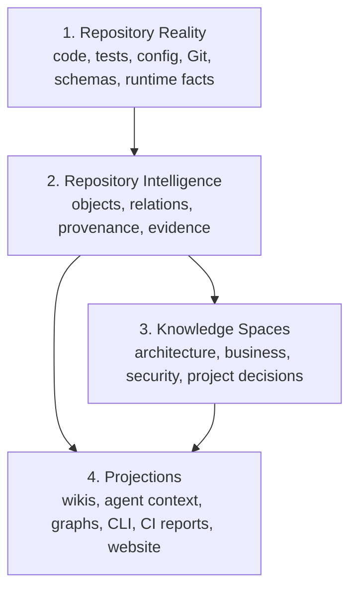

# Part 1: Problem And Architecture

Part of the candidate
[`2026-09-14-repository-intelligence-and-wiki-projections`](../2026-09-14-repository-intelligence-and-wiki-projections.md).
Original proposal text, preserved. Section numbers are the author's.

---

# 2. Original problem

Hydra's framework implementation has evolved faster than its public and human-facing documentation.

The immediate symptom is that:

```text
project-wiki/hydra-framework/
```

does not reliably describe everything that exists in the current framework.

This is not merely a one-time writing problem. The documentation model makes drift too easy:

```text
implementation changes
        |
maintainer must remember affected documentation
        |
some pages are missed
        |
wiki becomes incomplete or stale
```

A one-time rewrite would improve the current situation but would not prevent the same problem from returning.

The actual problem is:

> Hydra does not yet mechanically understand which human-facing documentation depends on which parts of repository truth.

The proposed solution grew beyond simple documentation synchronization into a broader capability:

> Hydra should understand its repository graph and produce, validate, and compare multiple projections of that truth.

Documentation is one important projection, but not the only one.

---

# 3. Core architectural idea

The central idea is:

> Markdown is not the repository knowledge model. Markdown is one readable projection of repository intelligence.

The system can be understood as four layers.



## 3.1 Repository reality

This is what actually exists:

- Source code
- Tests
- Configuration
- Schemas
- Command implementations
- Registries
- Git history and changed paths
- Runtime facts
- Telemetry
- Generated files
- External interfaces

Repository reality is the primary authority for statements about current implementation.

## 3.2 Repository intelligence

Hydra interprets reality as structured objects and relationships:

- Source objects
- Commands
- Capabilities
- Schemas
- Providers
- Reducers
- Validators
- Tests
- Decisions
- Constraints
- Business rules
- Evidence
- Provenance
- Tasks
- Documentation concepts and claims

This is the underlying repository graph.

## 3.3 Knowledge spaces

Spaces organize relevant knowledge into bounded semantic domains:

- `.NET architecture`
- React architecture
- HMS business domain
- Reception
- Fiscalization
- Security
- Project decisions
- Hydra framework
- Temporary task knowledge

A space is not merely a directory of Markdown files.

A space is:

> A bounded knowledge domain or semantic lens over objects in the repository graph.

## 3.4 Projections

Different consumers need different views of the same underlying information:

- Human-readable wikis
- README content
- Agent context packages
- Provider adapters
- CLI output
- Generated reference documentation
- Architecture diagrams
- PR impact reports
- CI audit reports
- An interactive documentation website

The underlying knowledge can function without any wiki or website.

---

# 4. Critical terminology and boundaries

Several concepts must remain separate.

| Concept | Meaning |
| --- | --- |
| Repository graph | Structured objects, relations, evidence, and provenance |
| Knowledge space | A semantic/context boundary over graph knowledge |
| Wiki | A named human-readable documentation surface |
| `project-wiki/` | The repository directory that hosts one or more wikis |
| Hydra wiki | Hydra-managed documentation shipped with the framework |
| Projection | A representation derived from repository intelligence |
| Website | An interactive renderer over wiki and graph projections |
| Claim | A durable factual assertion appearing in documentation |
| Generated reference | Exact mechanical documentation derived from implementation |

These concepts should not collapse into one another.
