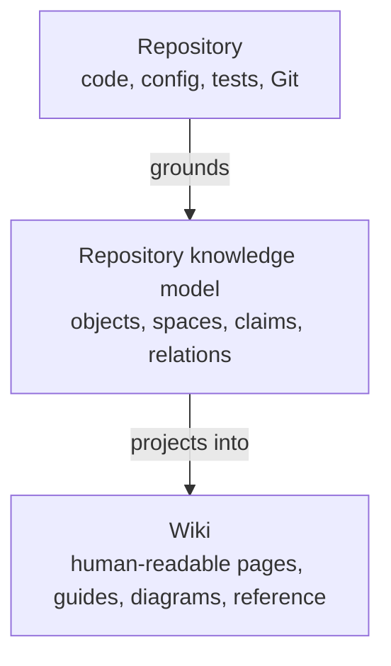
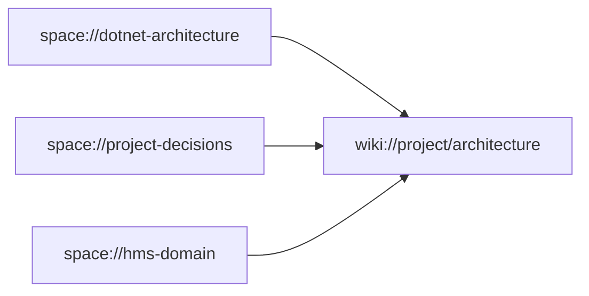

# Part 2: Wikis And Knowledge Spaces

Part of the candidate
[`2026-09-14-repository-intelligence-and-wiki-projections`](../2026-09-14-repository-intelligence-and-wiki-projections.md).
Original proposal text, preserved. Section numbers are the author's.

---

# 5. `project-wiki` remains a wiki host

The existing product concept should be preserved:

> Hydra includes its own framework wiki, while repositories may create additional wikis.

A possible directory structure is:

```text
project-wiki/
|-- home.md
|-- hydra-framework/
|   |-- getting-started/
|   |-- concepts/
|   |-- architecture/
|   |-- operations/
|   `-- reference/
|-- project/
|   |-- architecture/
|   |-- development/
|   `-- decisions/
|-- business/
|   |-- reception/
|   |-- restaurant/
|   `-- fiscalization/
`-- operations/
```

Therefore:

```text
project-wiki = wiki host
```

It is not itself one indivisible wiki.

Possible logical identities include:

```text
wiki://hydra-framework
wiki://project
wiki://business
wiki://operations
wiki://onboarding
```

The root `project-wiki/home.md` remains a human-readable portal linking to the
Hydra Framework wiki, the project wiki, and the business wiki.

---

# 6. The wiki remains a reading surface

A wiki should remain understandable as ordinary Markdown.

A person should be able to read it through GitHub, Obsidian, an editor, a
static site, or any normal Markdown renderer. Hydra should not require a
database server or running framework just to read the documentation.

The machinery lives underneath the wiki:



A page such as `project-wiki/business/reception/check-in.md` remains a normal
document. Underneath, Hydra may know:

```text
page
  `-- documents -> capability://reception/check-in

capability
  |-- belongs-to -> space://hms/reception
  |-- implemented-by -> source://CheckInGuestHandler
  `-- governed-by -> rule://reception/checkin-requires-room

rule
  |-- enforced-by -> source://CheckInValidator
  |-- tested-by -> test://CheckInValidatorTests
  `-- documented-by -> documentation://business/check-in
```

The reader does not need to understand this graph. Hydra uses it to evaluate
trustworthiness, impact, coverage, and staleness.

---

# 7. Hydra's own wiki is a managed projection

The first use case should be Hydra dogfooding this model.

```text
Hydra implementation and canonical knowledge
                    |
        Hydra repository intelligence
                    |
          wiki://hydra-framework
                    |
     audit, graphs, reference, website
```

Hydra's framework wiki should have explicit ownership:

```yaml
id: hydra-framework
title: Hydra Framework
owner: hydra
managed: true
root: project-wiki/hydra-framework
```

Its scope should include Hydra's engine, commands, object model, context
compiler, query and reference model, knowledge system, providers and profiles,
reducers, validation, telemetry, integration and takeover workflows, task
lifecycle, trust boundaries, shared/private behavior, and extension model.

Project or business knowledge must not leak into Hydra's own wiki merely
because everything exists in the same repository graph. The graph may be
shared. The projection boundaries are not.

---

# 8. Multiple wikis

A repository should eventually be able to declare named wikis.

Conceptually:

```yaml
wikis:
  hydra-framework:
    title: Hydra Framework
    owner: hydra
    managed: true
    root: project-wiki/hydra-framework
    sources:
      - hydra-framework

  project:
    title: Project Wiki
    owner: repository
    managed: false
    root: project-wiki/project
    sources:
      - project
      - project-decisions
      - dotnet-architecture

  business:
    title: Business Wiki
    owner: repository
    managed: false
    root: project-wiki/business
    sources:
      - hms-domain
      - reception
      - restaurant
      - fiscalization
```

This exact YAML is illustrative. The reviewer should determine whether wiki
configuration belongs in a dedicated manifest, in existing Hydra
configuration, represented through Hydra objects, or derived from paths.

Possible commands:

```bash
hydra.py wiki list
hydra.py docs audit --wiki hydra-framework
hydra.py docs audit --wiki project
hydra.py docs coverage --wiki business
```

---

# 9. Knowledge spaces are not wikis

A knowledge space and a wiki solve different problems.

## Knowledge space

Machine/context-oriented knowledge:

```text
space://dotnet-architecture
space://hms-domain
space://hms/reception
space://fiscalization
space://project-decisions
```

Used by agent context compilation, relevance selection, repository analysis,
rule and constraint resolution, impact analysis, and documentation projections.

## Wiki

Human-facing documentation:

```text
wiki://hydra-framework
wiki://project
wiki://business
```

Used for reading, learning, onboarding, understanding workflows, reference, and
architecture explanation.

A wiki may draw knowledge from several spaces:



One space may also feed several consumers:

```text
space://fiscalization
    |-- wiki://project
    |-- wiki://business
    |-- agent context
    |-- impact analysis
    `-- generated graphs
```

---

# 10. Spaces should compose, not inherit

Do not model spaces through classical inheritance:

```text
reservations extends reception extends HMS extends dotnet
```

That would create brittle hierarchies and unclear precedence.

Use composition and explicit relationships:

```yaml
space: hms/reception/reservations

uses:
  - dotnet-architecture
  - hms-domain

related:
  - hms/reception
  - fiscalization

scope:
  paths:
    - src/Features/Reception/Reservations/**
```

The context compiler should select relevant knowledge from multiple spaces.
For example, work on a reservation handler might compose global repository
knowledge, .NET architecture guidance, HMS domain constraints, reception
knowledge, reservation business rules, repository-specific decisions,
source-derived facts, and current task context.

The same source object may participate in multiple spaces:

```text
CreateReservationCommandHandler
    |-- belongs-to -> Reception
    |-- implements -> Command Handler Pattern
    |-- participates-in -> Reservation Lifecycle
    |-- uses -> ReservationRepository
    `-- governed-by -> Reservation Creation Rules
```

The object exists once. Spaces provide different semantic lenses over it.

---

# 11. Portable and repository-local knowledge

A future repository may combine reusable knowledge with local reality.

```yaml
spaces:
  external:
    - dotnet-enterprise@2
    - react-enterprise@3
    - postgresql@1

  local:
    - project-decisions
    - hms-domain
    - reception
    - fiscalization
```

This creates a composition of portable engineering guidance, repository
architecture decisions, business and domain knowledge, source-derived
repository facts, and current work context.

Portable guidance must never impersonate repository fact. For example:

- "Commands and queries should be separated." may be portable architectural
  guidance.
- "This repository uses MediatR for orchestration." may be a repository
  decision.
- "Feature X currently dispatches through MediatR." is a source-derived fact.

Those categories need different authority and behavior.

---

# 12. Epistemic categories and authority

Hydra should distinguish what kind of knowledge a statement represents.

| Category | Meaning |
| --- | --- |
| Guidance | A recommended pattern or practice |
| Decision | An approach deliberately chosen by this repository |
| Fact | Something derived from current repository reality |
| Business rule | Domain behavior that the system must preserve |
| Constraint | A condition implementation must obey |
| Evidence | Support for another object or claim |
| Assumption | Something believed but not yet verified |
| Observation | A recorded state that may be temporary |
| Plan | Intended future behavior, not current reality |

This prevents generic knowledge from overriding actual repository behavior.

Example conflict:

```text
Organization guidance:
"Domain entities should expose behavior."

Repository decision:
"Legacy EF entities remain anemic during the current migration."
```

The repository decision wins within this repository's scope without making the
general guidance invalid.

Possible authority scopes:

```text
organization
repository
domain
module
feature
task
temporary observation
```

The review should define deterministic conflict resolution based on knowledge
category, authority, scope specificity, recency, evidence quality, and explicit
override relationships.
