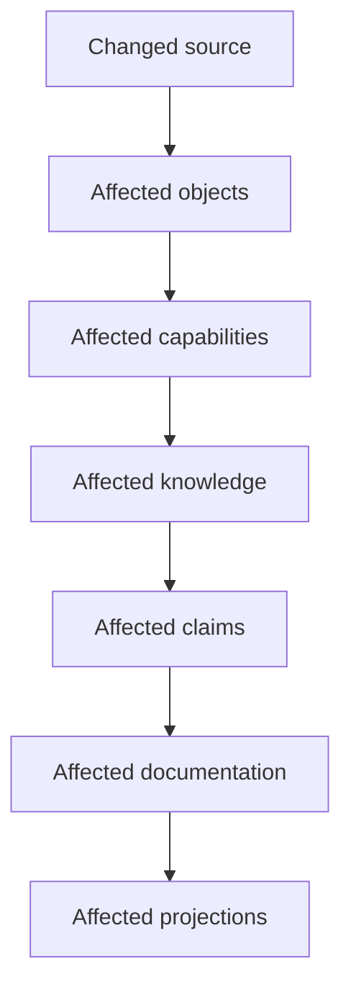
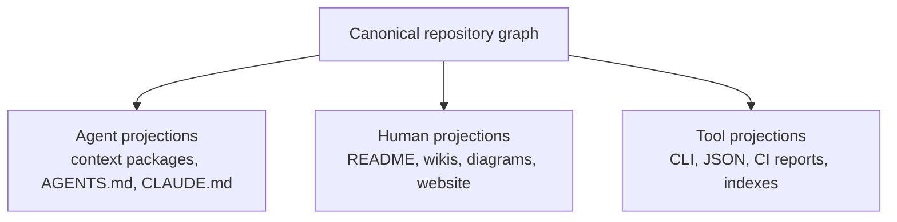

# Part 4: Commands And CI

Part of the candidate
[`2026-09-14-repository-intelligence-and-wiki-projections`](../2026-09-14-repository-intelligence-and-wiki-projections.md).
Original proposal text, preserved. Section numbers are the author's.

---

# 19. Generated graphs

Graphs should be first-class projections, not manually maintained decorative
diagrams.

Potential commands:

```bash
hydra.py graph architecture
hydra.py graph capability context-compilation
hydra.py graph docs
hydra.py graph impact <hydra-id>
hydra.py graph path <repository-path>
hydra.py graph space hms/reception
hydra.py graph wiki hydra-framework
```

Output formats might include:

```bash
hydra.py graph capability context-compilation --format mermaid
hydra.py graph capability context-compilation --format json
hydra.py graph capability context-compilation --format dot
```

Possible graph views include:

| Projection | Purpose |
| --- | --- |
| Repository graph | Modules, sources, ownership, dependencies |
| Architecture graph | Subsystems and capability relationships |
| Knowledge graph | Concepts, decisions, constraints, questions |
| Work graph | Tasks, dependencies, blockers, ownership |
| Evidence graph | Claims, source, tests, validations |
| Documentation graph | Pages, concepts, audiences, wikis |
| Space graph | Knowledge composition across domains |
| Change-impact graph | Changed source to downstream consequences |

The change-impact graph is especially important:



Generated diagrams may be embedded into Markdown through bounded generated
regions. Hydra must avoid rewriting surrounding authored prose.

---

# 20. `docs audit`

A future command such as `hydra.py docs audit` should go beyond Markdown link
validation.

Possible output:

```text
Documentation health: 87%

STALE CLAIMS

context-compilation.md
  Claim: Supported families
  Status: requires review

  Source changed:
    context_providers.py

  Impact:
    capability -> Context Compilation
    claim      -> Supported families
    docs       -> Context Compilation
                  Architecture Overview

UNDOCUMENTED CAPABILITIES

Telemetry Evidence
  implementation: confirmed
  reference: missing
  concept: missing

Integrate
  implementation: confirmed
  reference: generated
  concept: missing

ORPHAN DOCUMENTATION

old-routing-model.md
  no canonical object references this page

GRAPH DRIFT

architecture-overview.md
  generated graph differs from current graph

GENERATED REFERENCE DRIFT

commands.md
  command metadata changed
```

Potential audit categories: stale source dependency, stale factual claim,
missing documentation coverage, dead source path, orphan page, broken relation,
generated-reference drift, generated-diagram drift, wiki boundary violation,
unknown object identity, missing evidence, missing owner, unverified
high-contract page.

The tool should distinguish:

```text
ERROR
WARNING
REVIEW REQUIRED
INFORMATIONAL
```

Not every changed source should block CI.

---

# 21. Documentation coverage

Significant capabilities can declare expected documentation coverage.

```yaml
documentation_policy:
  context-compilation:
    concept: required
    reference: required
    architecture: required
    example: recommended

  integrate:
    concept: required
    reference: required
    architecture: recommended
    example: recommended

  move-object:
    concept: optional
    reference: required
    architecture: optional
    example: optional
```

Possible output:

```text
Capability              Concept   Reference   Example   Architecture
Context Compilation        y          y          y           y
Knowledge Search           y          y          n           y
Telemetry Evidence         n          y          n           n
Integrate                  n          y          n           n
Move Object                -          y          -           -
```

Coverage should not become a vanity percentage. It should reveal concrete
missing documentation required for a capability's audience and contract level.

---

# 22. `docs reconcile`

An agent-assisted command could prepare a bounded reconciliation package:

```bash
hydra.py docs reconcile
```

It might collect changed sources, changed Hydra objects, affected
capabilities, existing relevant pages, existing factual claims,
generated-reference differences, generated-graph differences, existing
rationale that must be preserved, and relevant tests and evidence.

Example agent package:

```text
Documentation reconciliation required.

Affected capability:
  Context Compilation

Canonical sources:
  ...

Existing pages:
  ...

Changed facts:
  ...

Restrictions:
  - Do not modify unrelated documentation.
  - Preserve authored rationale unless contradicted.
  - Do not claim planned behavior as implemented.
  - Regenerate mechanical sections through Hydra.
```

An agent may propose prose changes. Hydra, not the agent, determines which
areas require review.

Afterward, the normal validation flow runs:

```text
docs audit
ref check
validate-wiki
validate
tests
```

AI assists with explanation. It does not silently redefine repository truth.

---

# 23. Pull-request experience

A future PR report might contain:

```text
Hydra Documentation Impact

12 repository objects changed
3 capabilities affected
4 factual claims affected
3 wiki pages affected
1 generated diagram changed

Required review

  ok  CLI reference regenerated
  ok  Architecture graph regenerated
  no  Context Compilation claim requires review
  no  Working With Hydra requires review

Documentation coverage
92% -> 89%
```

A PR should make documentation impact visible without requiring an LLM to
judge whether prose is "good enough".

CI can mechanically determine that:

```text
context_providers.py changed
    |
Context Compilation capability affected
    |
two claims depend on that capability
    |
three documentation pages require acknowledgment
```

The maintainer can then update the page, regenerate a block, re-verify it
unchanged, or mark an impact as irrelevant with an explicit reason.

---

# 24. CI enforcement model

CI should be introduced gradually.

## Stage 1: Warning only

Report stale source dependencies, missing coverage, generated drift, orphan
pages, and unverified documentation.

## Stage 2: Selective blocking

Block only high-contract documentation: CLI command surface, installation and
adoption, schema and object contracts, task lifecycle, migration behavior,
trust boundaries, private/shared behavior, provider export behavior, required
validation behavior.

## Stage 3: Policy-based enforcement

Different wikis and document kinds may have different policies:

```yaml
policies:
  hydra-framework:
    reference:
      stale: error
    architecture:
      stale: review-required
    concepts:
      stale: warning

  business:
    business-rule:
      stale: error
    guide:
      stale: warning
```

CI should enforce acknowledgment and generated consistency. It should not
pretend it can mechanically prove the quality of arbitrary prose.

---

# 27. Projection as a generic Hydra concept

Documentation should not become an isolated special-case subsystem. Hydra can
formalize the broader concept of a projection.



Potential projection operations include:

```text
compile -> agent context
export  -> provider adapters
render  -> documentation
render  -> diagrams
render  -> website data
query   -> CLI
analyze -> impact reports
audit   -> drift detection
```

This provides a unified explanation for several things Hydra already appears
conceptually close to doing.

The architecture becomes:

> Hydra maintains structured, provenance-backed repository intelligence and
> produces consumer-specific projections from it.

Documentation is simply the most visible projection.
