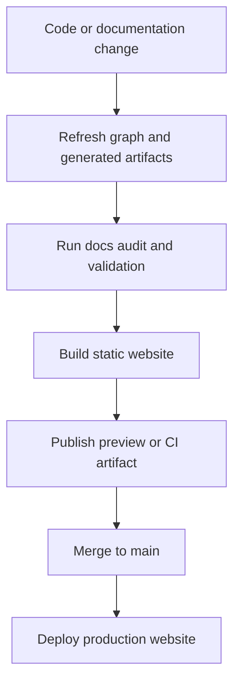

# Part 5: Interactive Website And Its Pipeline

Part of the candidate
[`2026-09-14-repository-intelligence-and-wiki-projections`](../2026-09-14-repository-intelligence-and-wiki-projections.md).
Original proposal text, preserved. Section numbers are the author's.

---

# 25. Interactive website

The future website should be treated as another projection, not as a
replacement source of truth.

```text
Markdown + generated graph snapshots
                    |
              static build
                    |
      interactive documentation website
```

The canonical material should remain repository-owned: Markdown, Hydra
objects, relations, provenance, generated JSON snapshots, generated diagrams.

The website reads these artifacts. Editing content directly in a website
database should not become the normal path.

## 25.1 Initial website

The first version can be a static documentation site providing wiki selection,
hierarchical navigation, full-text search, Mermaid rendering, source links,
previous/next navigation, audience filters, page ownership,
authored/generated/hybrid badges, last verification status, related
capabilities, related pages, copyable commands, and a responsive layout.

This can be built with a conventional static documentation stack. Possible
technologies include Astro, VitePress, Docusaurus, Next.js static export, or a
small custom Vite/React application.

The architecture should not be coupled to one frontend framework prematurely.

## 25.2 Graph explorer

A later version may provide an interactive repository graph, architecture view,
space view, wiki view, evidence view, documentation-dependency view, search by
Hydra identity, edge filtering, node-type filtering, depth controls, path
explanation, "Why is this page affected?" traversal, and direct navigation from
graph nodes to pages and source.

## 25.3 Documentation health dashboard

The website could expose stale pages, stale claims, missing capability
coverage, orphan pages, unverified high-contract documents, generated drift,
graph drift, coverage by wiki, coverage by space, coverage by capability, and
recent documentation-impact history.

## 25.4 Commit and PR views

A future site could visualize:

```text
commit
  -> changed sources
  -> affected objects
  -> affected capabilities
  -> affected rules and decisions
  -> affected claims
  -> affected pages
```

Users could compare the current branch against `main`, two commits, before and
after a release, or current implementation against last verified documentation
state.

## 25.5 Optional server-side future

A backend may eventually make sense for cross-repository search,
organization-wide portable spaces, runtime telemetry, authentication and access
policies, large graphs, historical graph queries, and collaboration and review
workflows.

It should not be required for the initial website. The initial implementation
should prefer a static build using generated repository artifacts.

---

# 26. Website CI/CD

A possible pipeline is:



## Pull-request pipeline

On a PR:

1. Determine changed repository paths.
2. Refresh affected repository objects.
3. Update or compare graph snapshots.
4. Regenerate deterministic reference sections.
5. Regenerate deterministic diagrams.
6. Run documentation impact analysis.
7. Run `docs audit`.
8. Validate wiki links and generated blocks.
9. Build the static site.
10. Publish a preview when supported, or upload the build as a CI artifact.
11. Add a concise documentation-impact report to the PR.

## Main-branch pipeline

After merge:

1. Rebuild from the committed source.
2. Run all required validation gates.
3. Produce the static site.
4. Deploy it to the selected hosting provider.
5. Record the source commit represented by the deployment.

Possible deployment targets: GitHub Pages, Cloudflare Pages, Azure Static Web
Apps, Netlify, Vercel, or an internally hosted static server.

The website should display the commit or version it represents.

## Key rule

The pipeline publishes a representation of committed repository truth. The
deployed site is never the only copy of documentation or graph data.
