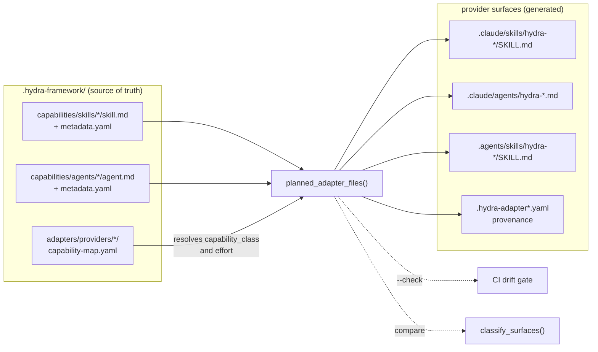
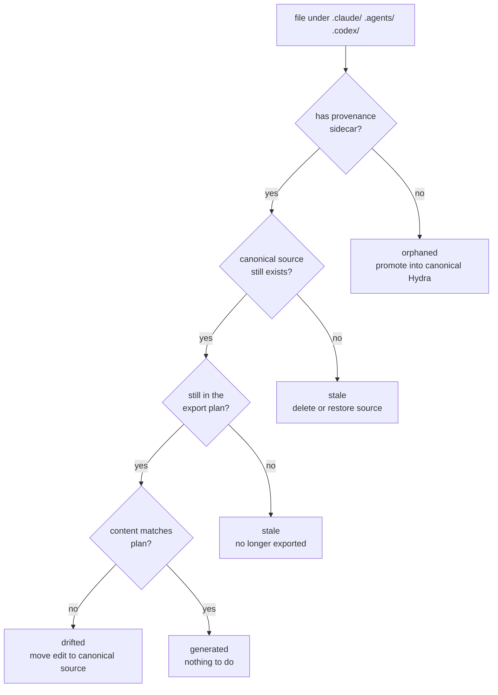
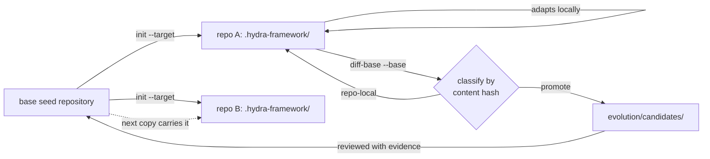

# Architecture Graph

Status: active
Updated: 2026-07-30

How Hydra's machinery fits together. Slices link outward from here.

## Canonical To Provider

One planner drives generation, `--check`, `--dry-run`, and surface
classification, so those four cannot disagree about what is generated.

## Surface Classification

`hook-post-edit` runs this on every write into a provider directory and prints
guidance for anything that is not `generated`. It never blocks the write.

## Copy And Reconcile

Divergence is the normal state. The return path is what keeps copies from
forking permanently.

## Validation Layers

| Layer | Trigger | Scope |
| --- | --- | --- |
| `hook-post-edit` | write into a provider dir or knowledge space | that file and its node |
| `route-prompt` | prompt submit | emits package pointers only |
| `validate` | manual, `doctor`, CI | task records, module metadata, capability maps, surfaces, contract drift, package links |
| `export-adapters --check` | manual, CI | generated-surface freshness |
| `selftest` | manual, CI | helper-script behavior |
| `doctor` | manual, CI | required paths, surface summary, lineage, then `validate` |

## Slices

- [Provider Export Example](01-example.md)
