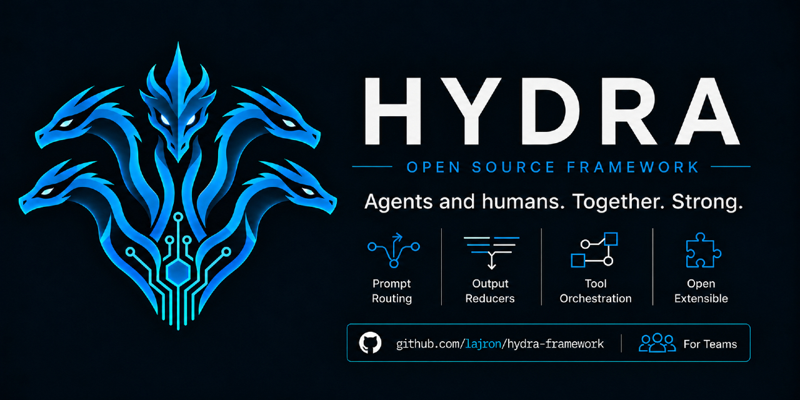

<p align="center">
  
</p>

## Give your team and AI agents a real place to work

Projects get messy when the important stuff is spread across people's heads,
chat threads, issue trackers, and old AI-agent sessions. Everyone ends up
asking the same questions: what is this repo, what happened before, what
matters here, and what are we allowed to change?

Hydra puts the shared parts of the answer in the repository:

- Context that people and agents can find when they need it.
- Tasks that survive a session and can move between people and agents.
- Rules, tools, and checks that make the work easier to understand and verify.
- A place to improve the setup as the project grows.

Hydra is built for people and agents to use together. The Python commands are
the engine behind it. People and agents can search for the right context, see
work already in flight, create or continue a task, run checks, and improve the
setup as they go. You can use the commands directly, but you do not need to
learn a new command line workflow just to use Hydra.

## Quick start

For a fresh clone, bootstrap the private local tier and the ignored provider
adapters before opening the repository in an agent:

```bash
git clone <repository-url>
cd <repository-directory>
python3 .hydra-framework/scripts/hydra.py init-local
python3 .hydra-framework/scripts/hydra.py export-adapters
python3 .hydra-framework/scripts/hydra.py doctor
```

`install-hooks` is optional. The adapter export is required for a new clone
because generated `.claude/`, `.agents/`, and `.codex/` surfaces are ignored by
Git. After bootstrapping, open the repository in Claude Code, Codex, or another
supported agent and ask a normal repository question, such as:

> Where does Hydra keep its canonical provider-adapter rules, and what should I read first?

Configured provider hooks route the prompt to Hydra's knowledge packages. The
agent can then use `knowledge-search` or `compile-context` for bounded context,
and `validate` or `doctor` to check the resulting work.

## Trust model

Hydra is repository-owned code. If a provider loads this checkout's hook
configuration, adopting Hydra allows that provider to execute Python from
`.hydra-framework/scripts/hydra.py` at configured lifecycle events: prompt
submission, edits, Bash output or failures, and provider subagent startup. The
commands may read repository files and may write ignored local state such as
logs, indexes, or generated adapters; they are not a security sandbox.

Review [Claude's settings](/.claude/settings.json), [Codex's hooks](/.codex/hooks.json),
and the [provider trust boundary](/.hydra-framework/adapters/providers/README.md#trust-boundary)
before enabling a provider session. Claude's shared settings intentionally
allow `Bash(python3 .hydra-framework/scripts/hydra.py:*)`, a wildcard covering
all Hydra subcommands. Treat that as a broad trust choice and narrow it in
local provider settings when needed.

## How you use it

1. Open a repository with Hydra in Claude Code, Codex, or another coding agent.
2. Give the agent the work you want done, the same way you normally would.
3. The repository instructions point the agent to Hydra. It uses the Python
   engine to find context, check existing work, manage task state, and validate
   its changes when those things are useful.

You do not need to paste a list of Hydra commands into every prompt. Hydra is
there so the agent has a better way to figure out the repository with you.

## It is your framework

Hydra does not tell you how your team has to work. It gives you the structure
to build the version you actually need.

You can use it to:

- Keep bugs, improvements, ideas, investigations, prompts, and release work as
  durable tasks that people and agents can pick up later.
- Build your own skills, specialist agents, pipelines, checks, and integrations.
- Connect the tools you already use, such as an issue tracker, CI, or internal
  systems.
- Teach agents the parts of the repository that matter without burying them in
  copied docs and old chat messages.
- Change the search, the context format, the task model, or anything else that
  stops fitting your team.

The point is not to install a fixed process. The point is to have solid blocks
to build on.

- Need a better triage flow? Build it.
- Need an agent that knows how to run releases? Build it.
- Have a better way to search or represent knowledge? Change it.

Hydra should get more useful and more specific as you use it.

## Clear enough for agents. Useful enough for people.

Models are not deterministic, and Hydra does not pretend they are. It makes the
surrounding system clear and repeatable:

- Context is concise and tied to sources.
- Work has an owner and a place to continue from.
- Rules and validation are written down instead of living in someone else's
  chat.

That gives an agent a better shot at doing the right thing, and it gives people
a system they can inspect, improve, and upgrade when their team, tools, or
models change.

## Bring your own tools and agents

Hydra is provider-neutral. Claude Code, Codex, local models, and future tools
can share the same repository-owned setup. Your existing issue tracker, CI,
and internal tools can stay part of the picture too. The core skills and agents
are written once, then exposed through the adapters each provider needs.

If Hydra is already in your repository, start using it for real work. The
[AI operating contract](AI_SYSTEM.md) is the short entry point for agents.

Want to add Hydra to another repository? Start with the
[adoption guide](project-wiki/hydra-framework/start-here/adopt-a-repository.md).

The [project wiki](project-wiki/home.md) has the technical detail: architecture,
commands, task state, knowledge, adapters, extension points, and operating
guidance. Start with [what Hydra is](project-wiki/hydra-framework/hydra-framework.md)
if you want the full picture.

Hydra is a `0.1.0` foundation seed. See the
[build status](.hydra-framework/repo/knowledge/spaces/hydra-framework/units/build-status.md)
and [public positioning brief](project-wiki/hydra-framework/reference/public-positioning.md)
for its current state and evidence boundaries.
