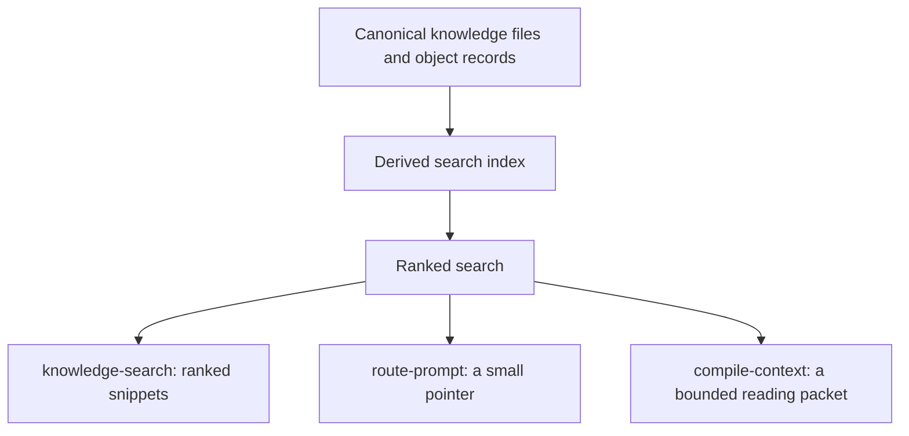

# Context Retrieval

For canonical ownership and maintainer evidence, see the [Source Map](/project-wiki/hydra-framework/reference/source-map.md#maintainer-evidence).

Before real work starts, an agent needs to know what to read. Hydra answers
that at three sizes, all built from the same underlying search so they never
disagree: `knowledge-search` returns raw ranked snippets for a query,
`route-prompt` is the small automatic pointer a provider hook attaches to a
prompt, and `compile-context` is the full, budgeted reading packet an agent
asks for explicitly before non-trivial work. If the search cache is missing
or stale, Hydra falls back to scanning the files directly instead of
erroring.



## How routing picks what to read

Each subject area (a knowledge space, or a node inside one) declares keywords
and named routes, task shapes like "adding a new skill." When a task's wording
overlaps enough with a route, that route wins and narrows reading down to the
handful of files it names instead of the whole space, along with commands to
verify afterward. Without a matching route, Hydra falls back to considering the
whole space.

Prompt wording is only the first phase. When known file paths are available,
verified bindings resolve them to the nodes that own them, and a bound node is
selected outright even if the wording pointed somewhere else. The exact fields
(`priority_units`, `requires`, `verify`, `expand_when`, and so on) are defined
in
[Knowledge Spaces](/project-wiki/hydra-framework/extending-hydra/knowledge-spaces.md);
this page is about how retrieval runs, not the space shape itself.

Everything else Hydra can retrieve (code, in-flight tasks, telemetry
evidence) has its own family with one retrieval provider, as described in
[Object And Context Model](/project-wiki/hydra-framework/architecture/object-context-model.md).
Knowledge uses the routing logic above; every other family shares one
generic search-and-rank collector, capped per family so no single family
crowds out the rest.

## Freshness

The search cache behind all three commands is disposable: if it is missing,
stale, or corrupt, Hydra scans the source files directly and rebuilds the
cache later (`hydra.py hook-reindex-knowledge`). That is separate from a more
serious kind of staleness: a knowledge file whose cited source has changed
since it was last checked. `hydra.py knowledge stale` finds that case, which
is a content problem for a person to fix, not a cache to rebuild.

## Worked example

For the prompt "adding a Hydra skill and exporting adapters," keyword
overlap selects the `hydra-framework` package, and the `add_module` route
matches specifically enough to narrow reading to one unit plus its verify
command (`export-adapters --check`). Everything selected is sorted by
priority and fit into the token budget; anything that doesn't fit is
reported as omitted, with a reason.

```bash
python3 .hydra-framework/scripts/hydra.py route-prompt --prompt "adding a Hydra skill and exporting adapters"
python3 .hydra-framework/scripts/hydra.py compile-context --task "Change Hydra task lifecycle fields" --package hydra-framework --budget 12000
```
