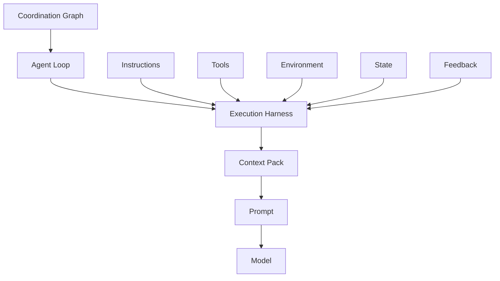

# Execution Stack

Hydra describes runtime responsibilities with this conceptual stack:

`Coordination Graph -> Agent Loop -> Execution Harness -> Context Pack -> Prompt -> Model`

| Layer | Responsibility |
| --- | --- |
| Coordination Graph | Coordinates tasks, agents, dependencies, handoffs, and recovery across loops. |
| Agent Loop | Drives one agent through understanding, readiness, planning, action, verification, and learning. |
| Execution Harness | Supplies instructions, tools, environment, state, and feedback for reliable model work. |
| Context Pack | Selects the canonical state, task facts, constraints, and assumptions the model should see. |
| Prompt | Carries the immediate instruction assembled from the selected context. |
| Model | Provides the provider-neutral reasoning and execution runtime. |


```mermaid
flowchart TB
  A[Coordination Graph] --> B[Agent Loop]
  B --> C[Execution Harness]
  C --> D[Context Pack]
  D --> E[Prompt]
  E --> F[Model]
  G[Instructions] --> C
  H[Tools] --> C
  I[Environment] --> C
  J[State] --> C
  K[Feedback] --> C
```

The Execution Harness is composed of five cooperating subsystems: Instructions,
Tools, Environment, State, and Feedback. Together they provide the operating
conditions around the prompt. The prompt is therefore one part of the system,
not the whole reliability mechanism.

## Orchestration Boundary

The Coordination Graph label is a responsibility boundary. This checkout now
has a small provider-neutral orchestration control plane for explicit
coordination, but it is not an unattended worker runtime.

| Concern | Implemented control | Not implied |
| --- | --- | --- |
| Run and task identity | A run names one existing task-record path and one explicit owner. | The ledger is not a copy of the task record or a shared task-status source. |
| Worker ownership | Each worker has an explicit owner, run, parent worker, role, depth, and task. | Ownership is never inferred from age, provider name, or a missing response. |
| Bounded coordination | `spawn`, `message`, and `collect` write bounded structured requests under the configured active-worker and depth limits. | There is no unbounded queue, background scheduler, or raw transcript store. |
| Review and validation | Complete results, independent review, independent validation, and explicit lifecycle transitions are recorded separately. | A queued or acknowledged adapter receipt is not execution or completion evidence. |
| Handoff and recovery | An owner names the next owner; a different explicit actor can recover a handed-off or recovery-required record. | Hydra does not infer stale-owner deletion, reap workers, or move task records implicitly. |
| Provider integration | Claude and Codex maps expose a request-only boundary for these operations. | Hydra does not claim to invoke a Claude or Codex SDK, start a provider worker, deliver a message, or collect runtime output. |

The control plane persists only a lock-protected private ledger under
`.hydra-framework.local/orchestration/`. Its adapter interface is a port for a
future provider integration, not an installed scheduler, worker registry,
message bus, or result collector. Use the [Command
Surface](/project-wiki/hydra-framework/reference/command-surface.md) for exact
arguments and the [Provider Adapters](/project-wiki/hydra-framework/extending-hydra/provider-adapters.md#orchestration-request-boundary)
route for runtime-specific limits.

The explicit sequence is:

```text
existing task record -> orchestration start -> bounded spawn/message/collect
-> explicit result -> independent review -> independent validation -> complete
```

`orchestration status` is read-only. Handoff, recovery, review, validation,
and completion are separate commands so a local record cannot silently turn a
provider request into finished work.

This stack is an architecture frame, not a filesystem layout. The repository
uses responsibility-first directories and represents execution layering through
metadata, placement rules, and internal structure. The [Architecture](/project-wiki/hydra-framework/architecture/architecture.md)
page provides the reader route; exact owners are listed in the [Source Map](/project-wiki/hydra-framework/reference/source-map.md#maintainer-evidence).

Continue to [Execution Flow](/project-wiki/hydra-framework/architecture/execution-flow.md) for the sequence of one work
cycle, or return to [Architecture](/project-wiki/hydra-framework/architecture/architecture.md).
