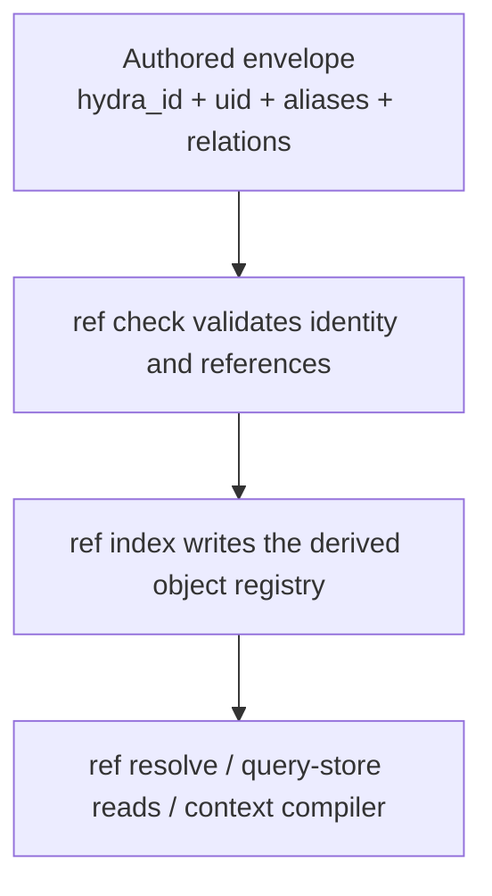

# Object And Context Model

For canonical ownership and maintainer evidence, see the [Source Map](/project-wiki/hydra-framework/reference/source-map.md#maintainer-evidence).

Hydra uses objects to give repository artifacts durable, resolvable identity.
Context compilation then selects a bounded, task-relevant view of those
artifacts. Both mechanisms derive their answers from canonical files; neither
is a second source of truth.

## Identity Without Path Coupling

An authored object declares a `hydra_id` in its envelope. That is its primary
reference. A `uid` distinguishes the same logical object across an
unambiguous move, while its path and digest describe its current location and
contents. Aliases preserve explicitly declared alternate references. Relations
name other objects, rather than replacing their identifiers with a file path.

The object-family registry classifies an object by identifier prefix first,
then by declared `kind`. The object-reference check rejects an unregistered
prefix or kind, duplicate identity, unresolved references, and missing
required envelope fields. A reference is therefore not made valid merely
because a similarly named file exists.

## Forms And Derived Stores

The object-handler registry decides which document forms can contribute an
envelope and where they are scanned. Today it covers Markdown and YAML across
the broader Hydra root, with YAML excluding `cognition/`, while Python is
rooted at `engine/src`. An unclaimed file form is not an error; it simply has
no registered envelope reader.

`ref index` exports the derived registry from validated canonical metadata.
The optional query store is local operational state. Its object, alias,
relation, and provenance tables are built from that export, while document and
reference rows are refreshed per changed file. A query uses the store only
when its schema and export digest are current. If it is missing, stale,
corrupt, or disabled, callers fall back to the scan path instead of treating
the cache as authority.

## How Context Is Routed

`compile-context` begins with any explicit object or path references, then
runs registered context providers. The Knowledge provider uses knowledge
packages and their routes, including required units and route-specific
verification guidance. Other current family providers select ranked search
matches from the shared search corpus. Candidate priority, deduplication, a
per-family cap, and the packet token budget keep selection inspectable and
bounded.

Each registered object family has exactly one context provider. The current
registry is an engine extension boundary, not a claim that every repository
file participates in context selection. `--include-family` and
`--exclude-family` narrow the current provider set when a caller needs a
smaller blast radius.

## Maintainership Boundary

Object families, handlers, stores, and providers describe the current engine
design. They are reviewed source-level extension points, not a plugin API or
an ABI guarantee. For a change recipe and its checks, use [Safe Extension
Recipes](/project-wiki/hydra-framework/extending-hydra/extension-recipes.md).
