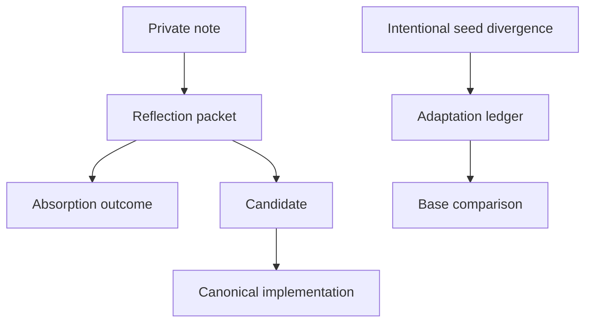
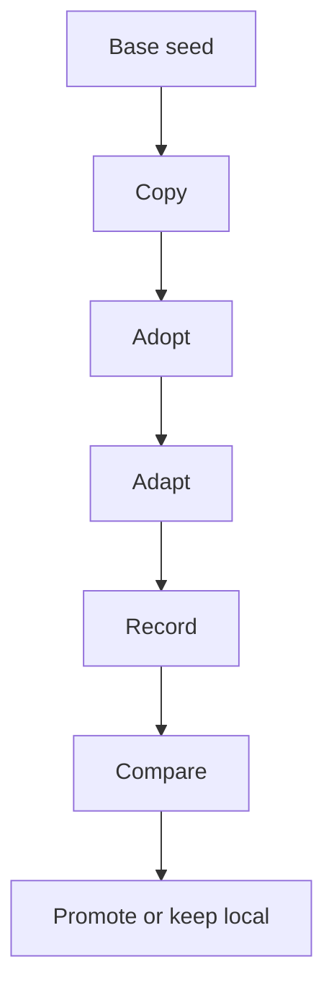

# Evolution

For canonical ownership and maintainer evidence, see the [Source Map](/project-wiki/hydra-framework/reference/source-map.md#maintainer-evidence).

Page type: orientation

If an adopted repository has changed its local `.hydra-framework/`, start by
deciding whether each difference is repository-local or should return to the
base seed. Run `adopt`, compare the copy with `diff-base`, and record deliberate
differences with `evolution record`. The [seed reconciliation lifecycle](/.hydra-framework/repo/knowledge/seed-reconciliation.md#lifecycle)
defines that route, and the [copy, adopt, and reconcile commands](/.hydra-framework/scripts/README.md#copy-adopt-reconcile)
show the supported invocations. Reconciliation reports and recommends; it does
not overwrite either side automatically.

This page routes the evolution queues and their next decisions. Their canonical
records and procedures remain under `.hydra-framework/evolution/`, `core/`,
`repo/knowledge/`, and `capabilities/`.

## The evolution channels

| Channel | Use it for |
| --- | --- |
| [Candidates](/.hydra-framework/evolution/candidates/README.md) | Worked-out improvement proposals, measured evaluations, and historical architecture records. |
| [Adaptations](/.hydra-framework/evolution/adaptations.md) | Intentional divergence from a base seed in an adopted repository. |
| [Reflections](/.hydra-framework/evolution/reflections/README.md) | Sanitized observations that are not yet proposals. |

Candidates use `proposed`, `accepted`, `rejected`, `captured`, or `superseded`
statuses. `proposed` is the only non-terminal status, and an accepted candidate
is not itself the implementation. Durable behavior belongs in its canonical
knowledge, capability, validation, or engine owner. Reflection packets use the
governed `open` or `held` states and must reach a terminal outcome such as a
follow-up, candidate, adaptation, canonical edit, or deletion. See the
[candidate contract](/.hydra-framework/evolution/candidates/README.md) and
[reflection contract](/.hydra-framework/evolution/reflections/README.md) for
the exact rules.

## From observation to durable change

Choose the smallest channel that can hold the current certainty:

Private notes hold early thinking. A reflection packet holds one sanitized
observation for review. A candidate holds a proposal with evidence. An
adaptation entry records why a downstream copy intentionally differs from its
base. The final durable change is written to the owner that can keep it true.

## Seed copies and reconciliation

Hydra spreads by copy, so local adaptation is expected. The reconciliation
lifecycle is:

Use `adopt` to inspect or record lineage, `evolution record` to append the
intent and evidence for deliberate divergence, and `diff-base` to compare
framework-definition files by content hash. The comparison separates explained
differences from unexplained differences. Each unexplained difference needs an
intent such as promote, repository-local, stale, or conflicting; the tool does
not overwrite either side automatically.

Use [Seed And Adopt Hydra](/project-wiki/hydra-framework/start-here/adopt-a-repository.md)
for the adoption route and [Command Surface](/project-wiki/hydra-framework/reference/command-surface.md)
for the seed commands. The [Source Map](/project-wiki/hydra-framework/reference/source-map.md#maintainer-evidence)
provides the bounded maintainer reading path.

## Propagating structural changes

Structural changes to a downstream copy need more than copying the changed
files. The downstream repository has its own lineage, records, generated
state, and deletions. The [Intake And Migration](/project-wiki/hydra-framework/extending-hydra/intake-and-migration.md)
route defines the sequence: capture a before comparison, take shared changes while
preserving lineage, preview and apply the migration command where applicable,
regenerate adapters, validate, and compare again. Deletions must be applied
explicitly because copying does not remove retired paths.

For inherited or foreign material, use the bounded [Migration](/project-wiki/hydra-framework/extending-hydra/migration.md)
route. For a non-Hydra agent setup, use its takeover section to keep detection
and migration explicitly scoped.

## Review and validation

Evolution records are reviewable shared state, not raw conversation memory.
The adaptation ledger is append-only. Candidate records remain as durable
evidence after their terminal status. Reflection packets are temporary review
items and are drained after their outcome is applied. Validation checks the
ledger and reflection contracts; seed command tests cover adaptation formatting,
comparison, and reflection behavior.

## Related pages

- [Engine](/project-wiki/hydra-framework/architecture/engine.md) explains the runtime ownership of seed
  commands and domain packages.
- [Command Surface](/project-wiki/hydra-framework/reference/command-surface.md) lists `diff-base` and
  `evolution record` with their command owners.
- [Intake And Migration](/project-wiki/hydra-framework/extending-hydra/intake-and-migration.md) covers
  source-material and downstream-copy handling.
- [Validation](/project-wiki/hydra-framework/operations/validation.md) explains the operational gates.
