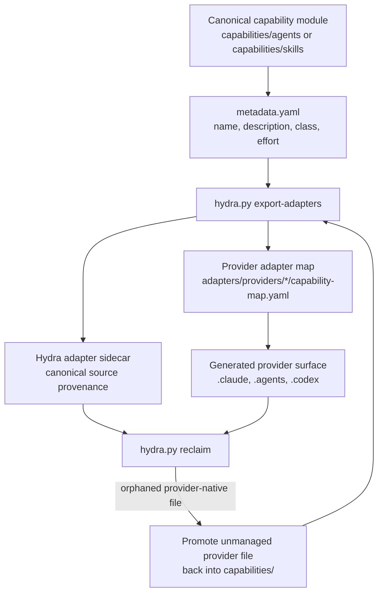

# Capabilities

For canonical ownership and maintainer evidence, see the [Source Map](/project-wiki/hydra-framework/reference/source-map.md#maintainer-evidence).

Status: orientation page

Capabilities are Hydra's reusable execution instructions: specialist agents,
skills, workflows, and tool capability records. They live under
`.hydra-framework/capabilities/`, and provider-facing files under `.claude/`,
`.agents/`, and `.codex/` are generated adapter surfaces, not the canonical
place to author behavior.

## The One-Sentence Pitch

Capabilities turn repeatable AI-agent behavior into versioned, reviewable
repository modules instead of scattered prompt text or hand-maintained provider
files.

## Canonical Layout

The rules this page explains live in `.hydra-framework/capabilities/`:

```
.hydra-framework/capabilities
├── README.md
├── agents
│   ├── README.md
│   └── <slug>/
│       ├── agent.md
│       └── metadata.yaml
├── skills
│   ├── README.md
│   └── <slug>/
│       ├── metadata.yaml
│       └── skill.md
├── tools
│   ├── README.md
│   └── capabilities.yaml
└── workflows
    ├── README.md
    ├── material-migration.md
    └── task-lifecycle.md
# curated: stable layout only; mutable skill and agent directories are omitted
```

## Capability Kinds

| Kind | Canonical path | Owns | Provider wrapper |
| --- | --- | --- | --- |
| Agents | `.hydra-framework/capabilities/agents/` | Specialist roles and decision boundaries. | Generated. |
| Skills | `.hydra-framework/capabilities/skills/` | Reusable procedures and expertise, including command-shaped skills. | Generated. |
| Workflows | `.hydra-framework/capabilities/workflows/` | Repeatable coordination patterns. | Canonical-only. |
| Tools | `.hydra-framework/capabilities/tools/` | Capability definitions and tool requirements. | Canonical-only. |

### Agents

Agents define roles, decision boundaries, inputs, outputs, and routing metadata.
They may reference skills, workflows, tools, and knowledge, but should not copy
skill instructions or canonical knowledge into the role file.

Each canonical agent has `agent.md` plus `metadata.yaml`.
`metadata.yaml` must include `name`, `description`, `capability_class`, and
`effort`; the capability class and effort budget are provider-neutral and are
resolved by provider adapters later.

### Skills

Skills are atomic reusable procedures or expertise. Promote a workflow into a
skill when it prevents meaningful re-derivation, has clear inputs and outputs,
has a stable procedure, can describe validation expectations, and is cheaper to
maintain than to rediscover.

Each canonical skill has `skill.md` plus `metadata.yaml`.
`metadata.yaml` must include `name` and `description`; optional fields include
`kind`, `argument_hint`, `allowed_tools`, `user_invocable`, and `tags`. Tags
feed capability profile selection; see
[Capability Profiles And Tags](#capability-profiles-and-tags).

### Workflows

Workflows coordinate agents, skills, tools, knowledge, validation, and lifecycle
behavior for repeatable objectives. They are not agents, and they should not
duplicate agent role instructions.

The workflow directory is the canonical index of repeatable coordination
patterns. The task lifecycle workflow is also the canonical prose description
of Hydra's task-record contract; other documents should link there instead of
restating the field list.

### Tools

Tools are defined by capability and requirement, not by hard-coded executable
names. Concrete mappings belong in private local state unless a mapping is safe
as a repository-wide recommendation.

The current tool registry includes capabilities such as repository search, Git
context, test execution, model routing, subagent spawn/message/collect, hook
policy, adapter export, token measurement, and memory recall.

## Capability Profiles And Tags

A checkout can narrow which canonical skills get materialized as provider
adapters, without touching the canonical skill catalog. A canonical skill may
declare `tags` in its `metadata.yaml`; a capability profile is a named set of
those tags. `export-adapters` renders every canonical skill whose tags match
the active profile (the union of skills matching any selected tag), plus a
small `baseline_tags` set that stays present in every profile. Agents are
never filtered by profile: every canonical agent is exported regardless of
which profile is active, and their dependency lines always print both the
provider wrapper name and the canonical skill path, since the wrapper name
alone may not be materialized under a narrow profile.

Shared profile policy lives in `.hydra-framework/capabilities/profiles.yaml`:
`baseline_tags`, `default_profile`, and named `profiles` presets. A checkout
may layer its own presets in `.hydra-framework.local/capabilities/profiles.yaml`
and records its selected profile in
`.hydra-framework.local/capabilities/active.yaml`; both are untracked and
private to the checkout, and Hydra never writes to the local `profiles.yaml`
so a person's presets and comments survive every `profile select`. The
reserved profile `full` selects every skill regardless of tags and needs no
declaration.

```bash
python3 .hydra-framework/scripts/hydra.py profile list
python3 .hydra-framework/scripts/hydra.py profile show [--profile <name>] [--untagged]
python3 .hydra-framework/scripts/hydra.py profile select <name>
python3 .hydra-framework/scripts/hydra.py export-adapters --profile <name> --dry-run
```

`profile list` shows shared and local profiles and which owns each name.
`profile show` reports the effective tags, the selected skills with the
reason each was selected, and, with `--untagged`, which canonical skills no
tag reaches yet. `profile select` records the choice and reconciles the
checkout's materialized adapters immediately, under a lock, because a
selection that does not reconcile would let a checkout's recorded profile and
its actual materialized skills silently diverge. `export-adapters --profile
<name> --dry-run` previews any profile without writing anything or requiring
it to be selected.

Narrowing a profile can delete previously materialized skill wrappers. See
[Ownership And Safe Deletion](/project-wiki/hydra-framework/extending-hydra/provider-adapters.md#ownership-and-safe-deletion)
for the proof every deletion must satisfy.

## From Canonical Module To Provider Surface



Author behavior once under `capabilities/`, then export. If someone
hand-authors a provider file, `reclaim` classifies it and can promote it back
into the canonical capability tree for review.

The current exporter generates provider skills and subagents from canonical
skills and agents. Workflows and tool capability records remain canonical
Hydra inputs, but they are not currently exported as provider wrapper files by
the `export-adapters` command.

## What It Uses / How To Use It

### Add A Skill Or Agent

Create the canonical module first:

```bash
mkdir -p .hydra-framework/capabilities/skills/<slug>
$EDITOR .hydra-framework/capabilities/skills/<slug>/skill.md
$EDITOR .hydra-framework/capabilities/skills/<slug>/metadata.yaml
python3 .hydra-framework/scripts/hydra.py export-adapters --dry-run
python3 .hydra-framework/scripts/hydra.py export-adapters
python3 .hydra-framework/scripts/hydra.py validate
```

For an agent, use `.hydra-framework/capabilities/agents/<slug>/agent.md` and
`metadata.yaml`, and include `capability_class` plus `effort`. Provider maps
resolve those fields into concrete provider values during export; canonical
module metadata should not name a specific model.

### Check Generated Provider Surfaces

```bash
python3 .hydra-framework/scripts/hydra.py export-adapters --check
python3 .hydra-framework/scripts/hydra.py export-adapters --dry-run
```

`--check` is a local drift check, not a CI gate; see
[Provider Adapters](/project-wiki/hydra-framework/extending-hydra/provider-adapters.md#check-adapter-drift)
for why. Use `--dry-run` to see what would be created, changed, or removed
without writing files.

### Reclaim Provider-Native Files

```bash
python3 .hydra-framework/scripts/hydra.py reclaim
python3 .hydra-framework/scripts/hydra.py reclaim --promote
python3 .hydra-framework/scripts/hydra.py export-adapters
python3 .hydra-framework/scripts/hydra.py validate
```

Run `reclaim` when a file appears under `.claude/`, `.agents/`, or `.codex/`
without a canonical Hydra source, or when validation reports unmanaged provider
surfaces. `reclaim --promote` moves hand-authored provider files into
`.hydra-framework/capabilities/` with inferred metadata, then the promoted
module must be reviewed and re-exported.

### Add Or Change Workflows And Tool Capabilities

Workflows live as Markdown objects under
`.hydra-framework/capabilities/workflows/`. Tool requirements live in
`.hydra-framework/capabilities/tools/capabilities.yaml`. After changing either,
run validation:

```bash
python3 .hydra-framework/scripts/hydra.py validate
```

If a workflow or tool change also requires a new skill or agent wrapper, add the
skill or agent under `capabilities/` and run the export sequence above. Do not
copy workflow policy into agent or skill files just to make a provider see it.
