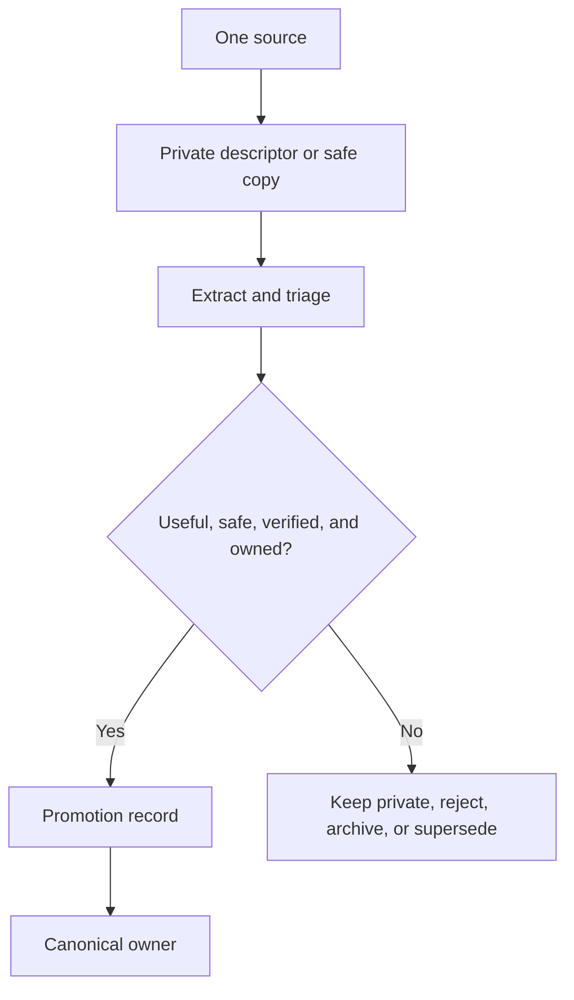

# Process One Source Through Intake

For canonical ownership and maintainer evidence, see the [Source Map](/project-wiki/hydra-framework/reference/source-map.md#maintainer-evidence).

Page type: operating guide

Use ordinary intake when one outside source needs review before its durable
meaning can become trusted repository knowledge. For a whole docs folder,
inherited wiki, prompt library, or other bounded source area, use [Migration](/project-wiki/hydra-framework/extending-hydra/migration.md)
instead.

## Flow



The early stages are private under `.hydra-framework.local/intake/`. A small
unverified observation can remain a private note instead of opening a full
intake chain. Do not make an extracted artifact or triage note canonical.

## Route The Outcome

Promote only durable meaning to the owner that actually owns it:

| Meaning | Canonical owner |
| --- | --- |
| Verified repository fact, convention, or procedure | `.hydra-framework/repo/knowledge/` |
| Reusable agent, skill, workflow, or tool | `.hydra-framework/capabilities/` |
| Framework improvement proposal | `.hydra-framework/evolution/` |
| Private, unsafe, unverified, duplicated, or valueless material | Private staging or a terminal rejection/archive outcome |

The promotion record
must carry the origin, checked date, privacy note, promoted claim, changed
canonical files, skipped material, uncertainty, and validation evidence. It
must stand alone and must not cite `.hydra-framework.local/`.

## Useful Entry Point

For a lightweight observation, use:

```bash
python3 .hydra-framework/scripts/hydra.py note "unverified observation to revisit"
```

For a source that needs descriptors, extraction, privacy review, or provenance,
follow the intake lifecycle
and its templates.

## Related Routes

[Migration](/project-wiki/hydra-framework/extending-hydra/migration.md) drains a bounded source area. [Seed And Adopt Hydra](/project-wiki/hydra-framework/start-here/adopt-a-repository.md)
brings Hydra into another repository without migrating its existing material.
[Knowledge Spaces](/project-wiki/hydra-framework/extending-hydra/knowledge-spaces.md) explains the destination for
repeated repository knowledge.
