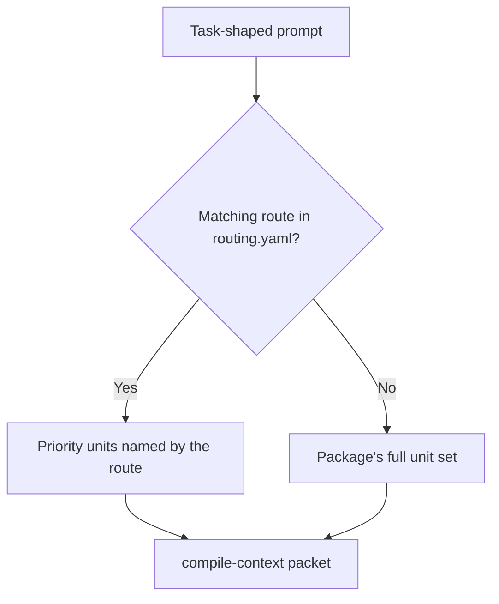

# Knowledge Packages

For canonical ownership and maintainer evidence, see the [Source Map](/project-wiki/hydra-framework/reference/source-map.md#maintainer-evidence).

Status: orientation page

Knowledge packages are Hydra's repeated local structure for repository areas
that carry durable operational complexity. Use one for an app, service,
library, bounded context, domain, integration, automation area, or framework
region that agents repeatedly need to understand. Do not create one for every
folder, and do not duplicate global rules that already belong in
`.hydra-framework/repo/knowledge/`.

## The One-Sentence Pitch

A knowledge package gives one meaningful repository area a small, routable
knowledge base: enough local state, source links, and unit answers for agents
to start correctly without rereading the whole repository.

## Package Concept

The package pattern exists for breadth and depth at the same time. Breadth
comes from a predictable directory shape across many areas. Depth comes from
package-local files that can answer specialized questions, record active
handoff, cite authority, track unresolved problems, and route an agent to the
right unit for a task.

Packages are still canonical repository knowledge, not wiki pages. They live
under `.hydra-framework/repo/knowledge/knowledge-packages/`, and the engine
discovers package roots there when a directory contains markers such as
`overview.md`, `routing.yaml`, `units/`, or `architecture/`. Templates under
`knowledge/templates/space/` are defaults for new packages, not a required
file count.

## Current File Shape

The current contract centers on a machine entrypoint, a short state pointer,
optional support files, and flat units:

| File or directory | Role |
| --- | --- |
| `routing.yaml` | The machine entrypoint. It names package keywords and task-shaped routes with `priority_units`, optional `requires`, `avoid_by_default`, `expand_when`, and `verify`. |
| `state.md` | A short active pointer and latest handoff, not a running log. |
| `overview.md` | Package boundaries, source-of-truth policy, reading map, and command surface. |
| `sources.md` | Authority anchors and intake provenance used by package claims. |
| `problems.md` | Concrete unresolved issues with evidence and next action. Divergences between authority and implementation belong in `units/` as `unit_kind: divergence`. |
| `definition-of-done.md` | The package-local completion bar for changes in this subject area. |
| `architecture/` | Human-readable package architecture pages when the package needs them. These are not the compiler's routing unit. |
| `units/<slug>.md` | One durable operational question per file. Units are addressable as `hydra://knowledge-unit/<package>/<slug>` and can contribute `reads:` candidates to `compile-context`. |

The active `hydra-framework` package has this file layout:

```text
.hydra-framework/repo/knowledge/spaces/hydra-framework/
├── architecture/
│   ├── 00-graph.md
│   └── 01-example.md
├── definition-of-done.md
├── glossary.md
├── overview.md
├── problems.md
├── routing.yaml
├── sources.md
├── state.md
└── units/
    ├── add-module.md
    ├── adopt-into-repo.md
    ├── agent-export-trace.md
    ├── build-status.md
    ├── change-task-contract.md
    ├── fix-provider-surface.md
    └── reconcile-with-base.md
```

## Anatomy

`routing.yaml` and `units/` make the package machine-routable. The support
files keep the package readable and maintainable for humans. Validation keeps
the package from becoming a disconnected notes folder.

## Routing And Units

Routes describe task shapes. A matching route narrows the context packet to
the units it names; without a matching route, `compile-context` falls back to
the package's unit set. `requires` units are budget-exempt only for the unit
file itself, while files named by a unit's `reads:` still compete for the
caller budget.



A unit is not a documentation page. It is a compiler input with frontmatter,
one operational `question`, a `unit_kind`, certainty metadata, optional
`reads:`, and optional `requires` or `see_also` references. Write a unit only
when a route or another unit will point at it. Below roughly five durable
questions, a single `overview.md` is the right shape.

## Size And Validation Discipline

Knowledge packages use the shared certainty vocabulary:
`confirmed`, `inferred`, `assumed`, `unresolved`, `conflicting`,
`superseded`, and `rejected`. Do not write design-stage material as shipped
behavior. Mark it as unresolved or planned in the owning metadata.

Every Markdown file under a package root has an 8000 approximate-token hard
ceiling. The ceiling is a tripwire for accidental large dumps, not a tuned
content target. There is no advisory warning tier yet because this repository
has no legitimate large package file near the ceiling.

`validate-package-docs` checks package Markdown links, routing, units, and
the package file-size ceiling. `hydra.py validate` includes that package gate
as part of the repository-wide validation set.

## What It Uses / How To Use It

### Validate A Package

Use the package documentation gate when a package file, unit, route, or
package-local link changes:

```bash
python3 .hydra-framework/scripts/hydra.py validate-package-docs --package hydra-framework
python3 .hydra-framework/scripts/hydra.py validate-package-docs --path .hydra-framework/repo/knowledge/spaces/hydra-framework
```

The gate can also render DOT diagrams when a package owns them:

```bash
python3 .hydra-framework/scripts/hydra.py validate-package-docs --package hydra-framework --render
```

### Get Route Pointers For A Prompt

Use route-prompt when a provider hook or human wants a small package-routing
hint, not a full context packet:

```bash
python3 .hydra-framework/scripts/hydra.py route-prompt --prompt "adding a Hydra skill and exporting adapters"
```

The command reads package `routing.yaml` files and prints paths and unit
pointers to read. It does not print package contents.

### Compile A Task Context Packet

Use compile-context when an agent needs a bounded context packet for a task:

```bash
python3 .hydra-framework/scripts/hydra.py compile-context --task "Change Hydra task lifecycle fields" --package hydra-framework --budget 12000
python3 .hydra-framework/scripts/hydra.py compile-context --task "Hydra context compiler" --json
```

The packet reports selected context, omitted candidates, required-unit
overage, token estimates, provenance or freshness notes, and route validation
reminders. It prints read pointers and metadata, not full file bodies.

### Write Or Revalidate One Unit

Use the knowledge-unit skill for one bounded unit, not for deciding whether
content belongs in a package at all:

```bash
sed -n '1,180p' .hydra-framework/capabilities/skills/knowledge-unit/skill.md
```

The unit's question must be one operational question, its cited paths must
resolve unless the unit is explicitly unresolved, and validation must pass
after the change.

## Next Action

From the [Extending Hydra](/project-wiki/hydra-framework/extending-hydra/extending-hydra.md)
route, choose the package boundary before creating or updating a package. After
changing its routes, units, or supporting files, run:

```bash
python3 .hydra-framework/scripts/hydra.py validate-package-docs --package <package-slug>
```
