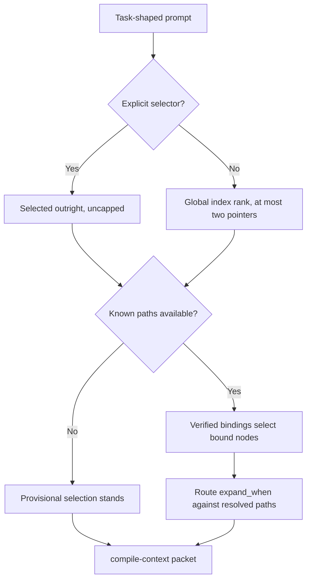

# Knowledge Spaces

For canonical ownership and maintainer evidence, see the [Source Map](/project-wiki/hydra-framework/reference/source-map.md#maintainer-evidence).

Status: orientation page

Knowledge spaces are Hydra's local structure for repository areas that carry
durable operational complexity. Use one for an app, service, library, bounded
context, domain, integration, automation area, or framework region that agents
repeatedly need to understand. Do not create one for every folder, and do not
duplicate global rules that already belong in
`.hydra-framework/repo/knowledge/`.

The frozen contract is
[Knowledge v3 Architecture](/.hydra-framework/core/knowledge-architecture.md).
This page is a reading map over it.

## The One-Sentence Pitch

A knowledge space gives one accountability boundary a small, routable
knowledge base: enough local state, source links, and unit answers for agents
to start correctly without rereading the whole repository.

## What v3 Separates

One structure does not solve every concern, so v3 splits five of them:

| Concern | Mechanism |
| --- | --- |
| Containment and accountability | The space and node tree |
| Cross-cutting meaning | Typed relations between spaces |
| Reading order | Views, which reference and never copy |
| Portability | Namespaced logical bindings |
| Distribution | Scopes, independent of registry layout |

## Space Concept

Spaces are canonical repository knowledge, not wiki pages. They live under
`.hydra-framework/repo/knowledge/spaces/`, and `spaces.yaml` is the reviewed
closed list of them. Discovery never treats a directory as a space because it
exists; an unlisted directory is a validation failure, not a new space.

A listed space has one `space.yaml`. Every descendant directory that
participates in the tree has one `node.yaml`. Units are legal directly under
any routable space or node, and an empty structural level is invalid.

The default topology is three levels including the space, and four is the hard
ceiling. When a fourth level is tempting, the legal choices are to attach the
fact to its containing node, promote a real stable boundary, or express the
cross-cutting concern as a typed relation or a view.

Path segments name stable system boundaries, never current team names.
Ownership is mutable metadata, so changing an owner never changes an identity.

Templates under `knowledge/templates/space/` are defaults for a new space, not
a required file count. The node template ships as `space.yaml.template` so it
is not discovered as a live node before anyone copies it.

## Current File Shape

| File or directory | Role |
| --- | --- |
| `space.yaml` | The machine entrypoint. It carries the object envelope, `scope`, `routable`, keywords, and task-shaped routes with `priority_units`, optional `requires`, `avoid_by_default`, `expand_when`, and `verify`. |
| `<node>/node.yaml` | The same document shape for a descendant boundary inside the space. |
| `state.md` | A short active pointer and latest handoff, not a running log. |
| `overview.md` | Space boundaries, source-of-truth policy, reading map, and command surface. |
| `sources.md` | Authority anchors and intake provenance used by claims in this space. |
| `problems.md` | Concrete unresolved issues with evidence and next action. Divergences between authority and implementation belong in `units/` as `unit_kind: divergence`. |
| `definition-of-done.md` | The local completion bar for changes in this subject area. |
| `architecture/` | Human-readable architecture pages when the space needs them. These are not the compiler's routing unit. |
| `units/<slug>.md` | One durable operational question per file. Units are addressable as `hydra://knowledge-unit/<space>[/<node>]/<slug>` and can contribute `reads:` candidates to `compile-context`. |

The active `hydra-framework` space has this file layout:

```text
.hydra-framework/repo/knowledge/spaces/hydra-framework/
├── architecture/
│   ├── 00-graph.md
│   └── 01-example.md
├── definition-of-done.md
├── glossary.md
├── overview.md
├── problems.md
├── sources.md
├── space.yaml
├── state.md
└── units/
    ├── add-module.md
    ├── adopt-into-repo.md
    ├── agent-export-trace.md
    ├── build-status.md
    ├── change-task-contract.md
    ├── fix-provider-surface.md
    └── reconcile-with-base.md
```

## Anatomy

`space.yaml` and `units/` make the space machine-routable. The support files
keep it readable and maintainable for humans. Validation keeps it from
becoming a disconnected notes folder.

## Two-Phase Routing

Routing happens in two explicit phases. Provisional prompt routing resolves
explicit selectors, then ranks nodes globally against the unified index and
emits at most two compact node pointers. A low-margin boundary is reported as
ambiguity rather than resolved by a lexical tiebreak.

Path-informed rerouting then resolves known paths through verified bindings.
A bound node is selected outright and may replace a provisional false match,
and matching route `expand_when` clauses are evaluated against the same
resolved path set. Explicit node, view, route, and bound-path selections are
never capped, and every selection records why it was made.



Routes describe task shapes. A matching route narrows the packet to the units
it names; without one, `compile-context` falls back to the space's unit set.
`requires` units are budget-exempt only for the unit file itself, while files
named by a unit's `reads:` still compete for the caller budget.

A route's global identity is its owning node identity plus its route name, so
`hydra://knowledge-route/<space>[/<node>]/<route>` is the executable form.
`--package` and `--domain` remain accepted as deprecated aliases for `--node`
and `--space`, and they resolve against v3 objects only.

`expand_when` is canonical on routes. Unconditional dependency is `requires`;
conditional selection is route `expand_when`. A unit-level `expand_when` is
invalid.

A unit is not a documentation page. It is a compiler input with frontmatter,
one operational `question`, a `unit_kind`, certainty metadata, optional
`reads:`, and optional `requires` or `see_also` references. Write a unit only
when a route or another unit will point at it. Below roughly five durable
questions, a single `overview.md` is the right shape.

## Relations, Views, And Scope

Knowledge relations are mappings with a closed type and a target, drawn from
`relates-to`, `governs`, `implements`, `tests`, `operates`, and `supersedes`.
`requires` closure is transitive across nodes and spaces; an unresolved target
or a cycle is a hard failure that reports the full edge path.

`supersedes` is directional. When a selected unit supersedes another selected
unit, the target is omitted and diagnostics name the edge. Two selected
siblings superseding the same target is a hard conflict that no path, lexical
order, or discovery order resolves. Only a governing view may resolve it, and
only by naming the exact winner and every conflicting candidate.

A view composes references into reading order and may hold no domain prose.
Views live under `knowledge/views/`.

Every addressable object declares its own `scope`, which is never inherited:

| Scope | Distribution |
| --- | --- |
| `base-seed` | Framework definition, copied by `init` and compared during base reconciliation |
| `common-seed` | Portable shared material, copied only by a named distribution profile |
| `repo-local` | Belongs to one adopted repository, never copied outward |

## Bindings

A logical name is `@<namespace>/<key>`, declared in a fragment under
`knowledge/bindings/` and listed in `bindings/manifest.yaml`. Each binding
names a repository-relative target, a kind of `file`, `directory`, or `glob`,
and assertions that prove the target is what the binding claims.

Resolution uses the longest matching verified target. Equal specificity is an
explicit ambiguity. A missing target or a failed assertion is stale, and a
stale or unresolved binding fails validation and cannot drive path routing,
route expansion, command execution, or provenance freshness.

Accepting a binding's assertion fingerprint is a write and never happens
implicitly during validation.

## Size And Validation Discipline

Knowledge spaces use the shared certainty vocabulary: `confirmed`, `inferred`,
`assumed`, `unresolved`, `conflicting`, `superseded`, and `rejected`. Do not
write design-stage material as shipped behavior. Mark it as unresolved or
planned in the owning metadata.

Every Markdown file under a space root has an 8000 approximate-token hard
ceiling. The ceiling is a tripwire for accidental large dumps, not a tuned
content target. There is no advisory warning tier yet because this repository
has no legitimate large file near the ceiling.

Ambiguity, unresolved references and bindings, dependency cycles, supersession
conflicts, view-order conflicts, invalid scopes, and depth violations all fail
closed.

`validate-package-docs` checks the node document, Markdown links, units, and
the file-size ceiling for the selected roots. `hydra.py validate` includes that
gate as part of the repository-wide validation set.

## What It Uses / How To Use It

### Validate A Space

Use the node documentation gate when a space file, unit, route, or local link
changes:

```bash
python3 .hydra-framework/scripts/hydra.py validate-package-docs --node hydra-framework
python3 .hydra-framework/scripts/hydra.py validate-package-docs --path .hydra-framework/repo/knowledge/spaces/hydra-framework
```

The gate can also render DOT diagrams when a space owns them:

```bash
python3 .hydra-framework/scripts/hydra.py validate-package-docs --node hydra-framework --render
```

### Get Route Pointers For A Prompt

Use route-prompt when a provider hook or human wants a small routing hint, not
a full context packet:

```bash
python3 .hydra-framework/scripts/hydra.py route-prompt --prompt "adding a Hydra skill and exporting adapters"
```

The command prints node pointers and the paths to read. It does not print
their contents. Add `--json` for the matched nodes with their reason, score,
and timing.

### Compile A Task Context Packet

Use compile-context when an agent needs a bounded context packet for a task:

```bash
python3 .hydra-framework/scripts/hydra.py compile-context --task "Change Hydra task lifecycle fields" --node hydra-framework --budget 12000
python3 .hydra-framework/scripts/hydra.py compile-context --task "Hydra context compiler" --json
```

The packet reports selected nodes, active views, source-traced effective
policy, selection reasons, omitted candidates, required-unit overage, token
estimates, freshness notes, and diagnostics. It prints read pointers and
metadata, not full file bodies.

### Inspect And Accept Bindings

Use the bindings commands when a logical name is added, or when a binding's
target legitimately changes:

```bash
python3 .hydra-framework/scripts/hydra.py bindings list
python3 .hydra-framework/scripts/hydra.py bindings verify
python3 .hydra-framework/scripts/hydra.py bindings verify --name @product/checkout --accept
```

`--accept` writes the reviewed fingerprint into the fragment. It refuses any
binding whose target is missing or whose assertions fail, so it cannot mark a
real defect as verified.

### Write Or Revalidate One Unit

Use the knowledge-unit skill for one bounded unit, not for deciding whether
content belongs in a space at all:

```bash
sed -n '1,180p' .hydra-framework/capabilities/skills/knowledge-unit/skill.md
```

The unit's question must be one operational question, its cited paths must
resolve unless the unit is explicitly unresolved, and validation must pass
after the change.

## Known Gaps

The distribution policy passes a deterministic two-profile fixture with no
repo-local leaks. It has not been validated against a real second company
repository, and that gate must not be represented as passed.

## Next Action

From the [Extending Hydra](/project-wiki/hydra-framework/extending-hydra/extending-hydra.md)
route, choose the space or node boundary before creating or updating one.
After changing its routes, units, or supporting files, run:

```bash
python3 .hydra-framework/scripts/hydra.py validate-package-docs --node <space-slug>
```
