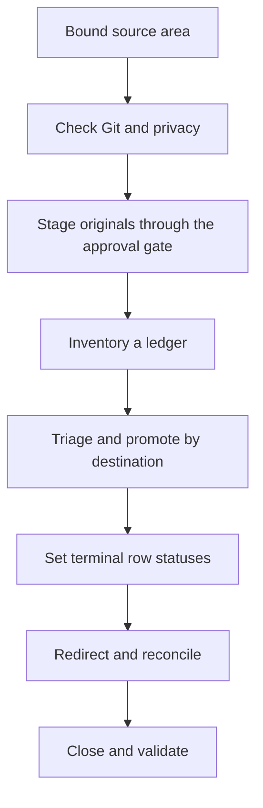

# Migrate A Bounded Source Area

For canonical ownership and maintainer evidence, see the [Source Map](/project-wiki/hydra-framework/reference/source-map.md#maintainer-evidence).

Page type: operating guide

Use migration when the job is to clear a bounded source area and account for
everything in it. Examples include an inherited wiki, transferred docs folder,
old prompt library, or legacy agentic setup. Use [ordinary intake](/project-wiki/hydra-framework/extending-hydra/intake.md)
for one source.

## Migration Flow


```mermaid
flowchart TB
  A[Bound source area] --> B[Check Git and privacy]
  B --> C[Stage originals through the approval gate]
  C --> D[Inventory a ledger]
  D --> E[Triage and promote by destination]
  E --> F[Set terminal row statuses]
  F --> G[Redirect and reconcile]
  G --> H[Close and validate]
```

## Stage Before Promoting

Bound the roots and count them before reading contents. Check who owns their
history and route the reversible staging move accordingly:

```bash
git ls-files <root> | wc -l
git check-ignore -v <root>
```

| Source state | Staging route |
| --- | --- |
| Already shared and tracked by Git | Tracked `.migrations/<source-slug>/` |
| Ignored, private, sensitive, or never committed | `.hydra-framework.local/migrations/<slug>/originals/` |

Request and approve the bounded staging action before moving anything or
promoting a claim. Move originals rather than copying them, so the source area
has one clear authority and the move remains reversible. The material
migration workflow
owns the request, approval, and staging details.

## Executable approval-gated sequence

The command flow below makes the three mutation gates visible. `inventory` and
`status` are read-only. `ledger --create` only creates migration workspace
scaffolding. The staging request records a digest-bound plan but does not move
anything. A human `decide approve` applies the exact action for the current
phase.

For material already under tracked `.migrations/`, inspect it first and create
workspace scaffolding only when needed:

```bash
python3 .hydra-framework/scripts/hydra.py migration inventory <slug> --json
python3 .hydra-framework/scripts/hydra.py migration ledger <slug> --create
```

The normal approval-gated batch is:

```bash
python3 .hydra-framework/scripts/hydra.py migration request-stage <slug> <batch> \
  --source <root> --route shared \
  --worker-instance <instance-id> --capability-class <class>
python3 .hydra-framework/scripts/hydra.py migration decide <slug> <batch> approve

python3 .hydra-framework/scripts/hydra.py migration propose <slug> <batch> \
  --manifest <proposal.json>
python3 .hydra-framework/scripts/hydra.py migration validate-batch <slug> <batch> \
  --evidence <validation.json>
python3 .hydra-framework/scripts/hydra.py migration decide <slug> <batch> approve

python3 .hydra-framework/scripts/hydra.py migration request-close <slug> <batch> \
  --reconciliation <reconciliation.json>
python3 .hydra-framework/scripts/hydra.py migration decide <slug> <batch> approve
python3 .hydra-framework/scripts/hydra.py migration status <slug> <batch> --json
```

Use `--route private` for a private or never-committed source, and repeat the
`--source` and `--worker-instance` options when one bounded batch contains
multiple roots or worker plans. The first approval applies only the recorded
staging move and creates the migration workspace when it does not already
exist. `propose` writes the batch proposal, while `validate-batch` records fresh
independent validation and opens publication approval. The second approval
publishes only the validated canonical writes. `request-close` records the exact
staged paths for removal; the final approval removes only those paths and keeps
the ledger, evidence, decision history, and workspace.

Reject or revise decisions keep the originals in place or keep the batch open
for correction. They never turn an unapproved request into a move, publication,
or removal. Inspect the current arguments and side-effect annotations with
[`Command Surface`](/project-wiki/hydra-framework/reference/command-surface.md)
and `command-metadata --json` before adapting this sequence.

## Drain The Ledger

Create one migration workspace under
`.hydra-framework/intake/migrations/<YYYY-MM-DD>-<slug>/` and inventory the
staged area into its ledger. Triage rows by destination, then promote related
meaning in batches. Terminal statuses are `promoted`, `kept-private`,
`rejected`, and `redirected`; a `deferred` row needs a follow-up owner before
it is terminal.

Do not measure completion by the number of promotions. The migration is ready
to close only when no row is pending, every item has a terminal outcome, and
the workspace records the final reconciliation. Leave one redirect at each
drained source root where readers may still look.

## Take Over Legacy Agentic Material

Takeover is an explicit migration path for an existing non-Hydra or legacy
agentic setup. First classify candidate roots such as `.claude/`, `.codex/`,
`.agents/`, Cursor, Windsurf, Copilot, prompt libraries, or old agent files.
The read-only takeover scan records the classifications and staging
recommendations:

```bash
python3 .hydra-framework/scripts/hydra.py takeover scan --root /path/to/repository --json
```

Generated Hydra adapters remain adapters, not canonical sources. Confirm the
roots and scope with the owner, then use the migration workflow to stage,
triage, promote, redirect, and close them.

If the source already contains a Hydra copy, use [Hydra-to-Hydra integration](/project-wiki/hydra-framework/extending-hydra/intake-and-migration.md#hydra-to-hydra-integration)
instead of this foreign-material takeover route.

Adoption is separate: [Seed And Adopt Hydra](/project-wiki/hydra-framework/start-here/adopt-a-repository.md)
leaves existing repository material in place. Do not start takeover as part of
adoption.

## Related Routes

[Process One Source Through Intake](/project-wiki/hydra-framework/extending-hydra/intake.md) is the smaller per-source path.
[Seed And Adopt Hydra](/project-wiki/hydra-framework/start-here/adopt-a-repository.md) is the
non-destructive new-repository path. Use [Validation](/project-wiki/hydra-framework/operations/validation.md)
for the final evidence gate.
