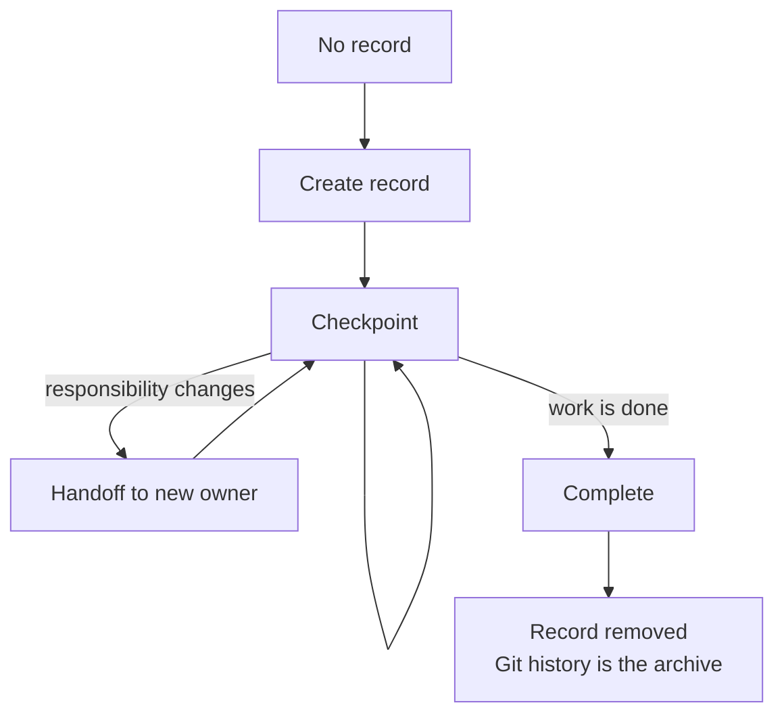

# Task Lifecycle

For canonical ownership and maintainer evidence, see the [Source Map](/project-wiki/hydra-framework/reference/source-map.md#maintainer-evidence).

Status: orientation page

Task records are tracked continuation state for work whose loss would cost the
next agent or teammate real effort. They make non-trivial work resumable
without turning raw conversation history into repository memory.

The [Task Lifecycle Workflow](/.hydra-framework/capabilities/workflows/task-lifecycle.md)
owns the exact record contract; this page explains how to use it safely.

## Start Or Resume

Run the board before creating state:

```bash
python3 .hydra-framework/scripts/hydra.py board
```

If an existing record covers the objective, read it and continue it. If no
record covers non-trivial work, create one:

```bash
python3 .hydra-framework/scripts/hydra.py task start <name> \
  --goal "Describe the engineering objective"
```

The owner is resolved from `--owner`, then `HYDRA_OWNER`, then
`git config user.email`. The selected value is slugified in full, including an
email domain. If none is available, creation fails rather than placing work
under a guessed shared owner. The new file is a skeleton, so fill its
readiness, step state, changed-files, validation, and continuation fields
before execution.

Commands that take `<name-or-path>` resolve a path-shaped value exactly. A bare
name is slugified, prefers one matching record under the caller's owner, and
otherwise succeeds only when the global match is unique. Multiple matches are
refused with their paths; pass one explicit path. Read anyone's record, but
edit only the current owner's record by default. `--force` is a deliberate
override, not an ownership transfer.

## Required Record Shape

Every persisted non-trivial record needs these answers:

| Area | What the record must make clear |
| --- | --- |
| Header | `Owner:`, `Created:`, and the current `Updated:` date |
| Goal | The objective another agent can resume without the original conversation |
| Readiness | status, branch or workspace assumptions, canonical docs, dependencies or private requirements, blockers and assumptions, and expected validation |
| Step State | active step, next step, completed steps, plus superseded or skipped steps when relevant |
| Continuation Notes | running state and the first resume check |
| Evidence | changed files and validation performed |

The executable required-section list lives in
`checks/task_contract_docs.py`; the workflow and `tasks/templates/task.md`
must agree with it. `hydra.py validate` checks labels and also refuses an
owner header that disagrees with the owner directory. It does not decide
whether a blocker or completed step is meaningful, so write those facts for the
next reader.

## The Lifecycle

1. Decide whether the work meets the workflow's persistence triggers. Small,
   self-contained work does not need a formal record.
2. For persisted work, use the existing owner-scoped record when one covers
   the objective. The board shows active records. Read anyone's record, but
   edit only your own.
3. Check readiness before execution, then maintain the record's step state,
   changed files, validation evidence, and continuation notes as the work
   progresses. The workflow, template, and validator own the exact record
   contract.
4. Checkpoint when work pauses, a blocker appears, context is low, or a
   handoff is likely. Use handoff when responsibility changes so the record
   and matching checkpoints move together.
5. When the work is complete, promote durable outcomes to their canonical
   owners, then complete the task. Completion removes the record because Git
   history is its archive.

The command-shaped procedure is maintained by the task state skill.
The exact field contract belongs to the task lifecycle workflow,
not this overview page.

## Orchestration And Task Records

An orchestration run references this existing task record by path; it does not
replace the task record or create a second shared status source. Worker owners,
parentage, requests, results, review, validation, handoff, and recovery live in
the bounded private orchestration ledger. Task ownership changes remain an
explicit `task handoff`, and do not silently reassign workers or infer that an
old owner should be deleted.


```mermaid
flowchart TB
  A[No record] --> B[Create record]
  B --> C[Checkpoint]
  C --> C
  C -->|responsibility changes| D[Handoff to new owner]
  D --> C
  C -->|work is done| E[Complete]
E --> F[Record removed<br/>Git history is the archive]
```

## Checkpoint And Handoff

Create a checkpoint when work pauses, a blocker appears, context is low, a
handoff is likely, or another developer needs to continue:

```bash
python3 .hydra-framework/scripts/hydra.py task checkpoint <name-or-path>
```

The checkpoint is created under the same owner's `checkpoints/` directory and
the task's `Updated:` field moves with it. Complete the checkpoint's goal,
current stage, changed files, validation, remaining work, blockers, and useful
references with facts, not a transcript.

When responsibility changes, use an explicit handoff:

```bash
python3 .hydra-framework/scripts/hydra.py task handoff <name-or-path> \
  --to <owner>
```

The command rewrites `Owner:`, writes the destination record and checkpoints
before removing the source, and prints a reminder to tell the recipient. A
rerun can finish an interrupted move. A different destination record is a
collision and is refused. A stale `Updated:` date is only an advisory signal;
it does not transfer ownership or authorize automatic reaping. Use the
[Review Routing For Shared Hydra State](/.hydra-framework/repo/knowledge/review-routing.md)
route for the reviewer boundary when shared framework files are involved.

## Recovery And Completion

The board is computed from personal task records. A derived task store may make
that view faster, but it is not an authored status source. Use `board --owner`
to inspect one owner, and `board --stale <days>` as a prompt to inspect old
work, not as proof that the work is abandoned.

Before completion, current task state must be recoverable from Git. Completion
refuses an untracked or unstaged task record or checkpoint because deleting it
would lose the last continuation state. If a handoff or completion was
interrupted, inspect the records and Git status, then rerun the appropriate
command only after resolving any destination or staging conflict.

First promote any durable result to its canonical owner. Then complete the
task:

```bash
python3 .hydra-framework/scripts/hydra.py task complete <name-or-path> \
  --outcome <repository-relative-file|none>
```

`--outcome none` is valid when no durable artifact was produced. Otherwise the
path must name an existing repository-relative file outside task scaffolding,
private local state, and private intake staging. Completion removes the task
and its checkpoints and stages the deletion when Git permits it. Review the
printed Git status. There is no separate completion archive; recover a deleted
record with:

```bash
git log --diff-filter=D -- <path>
```

## Useful Commands

```bash
python3 .hydra-framework/scripts/hydra.py task start <name> --goal "<goal>"
python3 .hydra-framework/scripts/hydra.py board
python3 .hydra-framework/scripts/hydra.py task checkpoint <name-or-path>
python3 .hydra-framework/scripts/hydra.py task handoff <name-or-path> --to <owner>
python3 .hydra-framework/scripts/hydra.py task complete <name-or-path> --outcome <path|none>
```

Run `python3 .hydra-framework/scripts/hydra.py validate` to check active task
records and the wider Hydra contracts. Validation catches missing required
labels and owner-directory disagreement; judgment about whether a checkpoint
is useful or whether completed steps contain meaningful evidence remains with
the author. The [Source Map](/project-wiki/hydra-framework/reference/source-map.md#maintainer-evidence)
lists the task validation owner.

The [Lifecycle](/.hydra-framework/core/lifecycle.md) rule supplies the
agent-loop boundary, while the [Placement Rules](/.hydra-framework/core/placement-rules.md)
own the shared, personal, and private state tiers.
